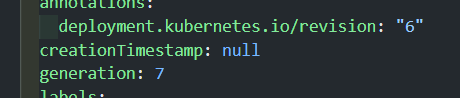

## Reflection 1
> Compare the application logs before and after you exposed it as a Service. Try to open the app several times while the proxy into the Service is running. What do you see in the logs? Does the number of logs increase each time you open the app?

Initially, before the application is exposed as a service, the logs only show messages indicating that an HTTP server has started on port 8080 and a UDP server on port 8081. Once the application is exposed as a service, enabling external interaction with the server from outside the Kubernetes cluster, opening the app causes an increase in log entries. This is due to a logging function within the server that records each incoming HTTP request along with a timestamp. Therefore, every time the app is accessed, a new HTTP request is sent to the server, resulting in additional log messages.

> Notice that there are two versions of kubectl get invocation during this tutorial section. The first does not have any option, while the latter has -n option with value set to kube-system. What is the purpose of the -n option and why did the output not list the pods/services that you explicitly created?

The -n flag specifies the namespace for the command. When using kubectl get pods,services -n kube-system, it retrieves all pods and services within the 'kube-system' namespace. Since the pods and services you created are in the 'default' namespace, they do not appear in the output when the -n flag is set to kube-system. This flag helps in filtering resources by their namespace.

## Reflection 2

> What is the difference between Rolling Update and Recreate deployment strategy?

Rolling Update and Recreate are two different deployment strategies. Rolling Update updates pods in a sequential manner, one by one, while retaining the old pods until the new ones are ready. This ensures uninterrupted service during the update process. In contrast, the Recreate strategy involves deleting all existing pods and creating new ones with the updated version simultaneously. Consequently, there's a brief downtime as the application is updated.

> Try deploying the Spring Petclinic REST using Recreate deployment strategy and document your attempt.

Start by changing th strategy in the deployment.yaml file to recreate, then apply the deployment.yaml.

Apply the modifications by executing the command kubectl apply -f deployment.yaml. This action triggers the deletion of existing pods, subsequently creating new ones with the updated application version. Observably, the recreate strategy entails the removal of all previous pods, reducing the old replica set count to zero, and initiating the creation of four new pods featuring the updated application version.

> Prepare different manifest files for executing Recreate deployment strategy.

The manifest files for the recreate deployment strategy can be found in the 'recreate.yaml' file in the repository.

> What do you think are the benefits of using Kubernetes manifest files? Recall your experience in deploying the app manually and compare it to your experience when deploying the same app by applying the manifest files (i.e., invoking `kubectl apply -f` command) to the cluster.

Kubernetes manifest files offer the advantage of defining the desired state of an application both declaratively and programmatically. This means specifying precisely how the application should be configured, and Kubernetes ensures it matches that specification. This approach simplifies deployment, updates, and deletion processes within a Kubernetes cluster by simply applying the manifest files. Contrasting this with manual deployment, where creating pods, services, and deployments is done manually, along with updates, manifest files streamline the entire process significantly. The automation provided by manifest files not only speeds up deployment but also enhances reproducibility. By reproducing the application in another cluster, simply by applying the same manifest files, consistency and reliability are ensured across environments.